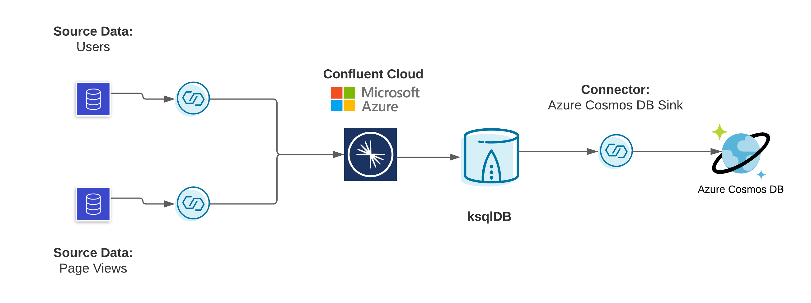
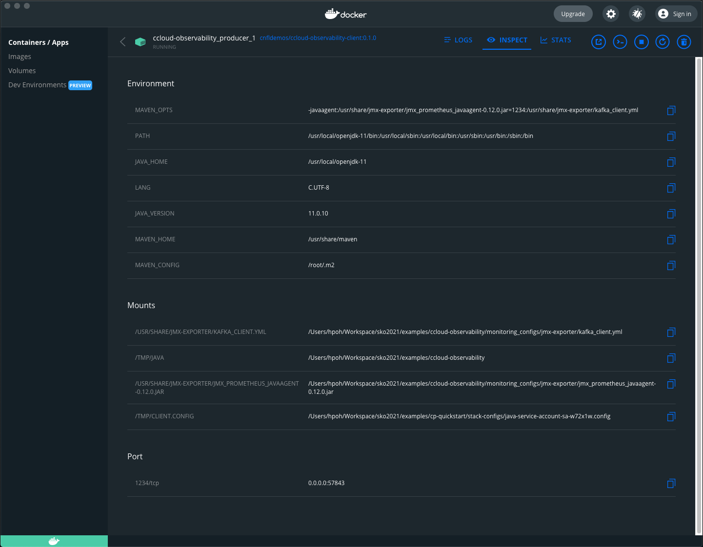

# Overview

This Confluent Cloud setup guide will help you to setup a cluster in your Confluent Cloud account running on Azure and ready to integrate Azure connectors. We will connect to Azure Cosmos DB as part of this demonstration.



# Prerequisites

* User account in [Confluent Cloud](https://www.confluent.io/confluent-cloud/tryfree/).
* Local install of the [Confluent CLI](https://docs.confluent.io/confluent-cli/current/install.html) v2.2.0 or later.
* Local install of the [Git](https://git-scm.com/book/en/v2/Getting-Started-Installing-Git).
* Local install of the [jq](https://github.com/stedolan/jq/wiki/Installation) tool.
* An Azure account with an active subscription.

# Setup

Clone this repository
```zsh
git clone https://github.com/JakeBogie/confluent-cloud-and-azure-demo-setup.git
```

Change directory to the cp-quickstart:
```zsh
cd cp-quickstart
```

Log in to Confluent Cloud. The `--save` argument saves your Confluent Cloud user login credentials or refresh token (in the case of SSO) to the local netrc file.
```zsh
confluent login --save
```

## Step 1 - Setup base cluster

### Confluent Cloud

Choose a region where you will deploy your Confluent Cloud cluster along with Azure resources. Make sure they are the same region.

This quickstart for Confluent Cloud leverages 100% Confluent Cloud services, including a [ksqlDB application](statements-cloud.sql) which builds streams and tables using Avro, Protobuf and JSON based formats. After logging into the Confluent CLI, run the command below and open your browser navigating to https://confluent.cloud. Note: the demo creates real cloud resources and incurs charges, make sure to clean up when you are done.

```bash
./start-cloud.sh
```

### Advanced usage

You may explicitly set the cloud provider and region. For example:

```bash
CLUSTER_CLOUD=aws CLUSTER_REGION=us-west-2 ./start-cloud.sh
```

Here are the variables and their default values:

| Variable | Default |
| --- | --- |
| CLUSTER_CLOUD | aws |
| CLUSTER_REGION | us-west-2 |

### Cleaning Up

To destroy this demo and its Confluent Cloud resources, call the bash script stop-cloud.sh and pass in the client properties file auto-generated in the step above. By Default, this deletes all resources, including the Confluent Cloud environment specified by the service account ID in the configuration file.

```bash
./stop-cloud.sh stack-configs/java-service-account-<SERVICE_ACCOUNT_ID>.config
```

Any Confluent Cloud example uses real Confluent Cloud resources. After you are done running a Confluent Cloud example, manually verify that all Confluent Cloud resources are destroyed to avoid unexpected charges.

## Step 2 - Setup S3 Sink connector

* Within Confluent Cloud, click on Connectors. You should see a list of connectors under Fully Managed.
* Click on Connect for the Amazon S3 Sink.
* Complete the configuration details.

    | Configuration Setting               | Value                         |
    |------------------------|-----------------------------------------|
    | Which topics do you want to get data from? | `ACCOMPLISHED_FEMALE_READERS`                      |
    | API Key                              | Generate a new API Key with Global access |
    | API Secret                           | Generate a new API Key with Global access |
    | Amazon Access Key ID                       | Enter your Amazon Access Key ID                    |
    | Amazon Secret Anccess Key                  | Enter your Amazon Secret Access Key                |
    | Bucket Name                                | Enter the name of your bucket/container            |
    | Input Kafka record value format            | JSON_SR                                            |
    | Output Message Format                      | AVRO                                               |
    | Time Interval                              | HOURLY                                             |
    | Flush Size                                 | 1000                                               |
    | Max span of record time before scheduled rotation          | 600000                                               |
    | Max span of record time before rotation                    | 600000                                               |
    | Tasks                                      | 1                                                  |
    | Name                                       | Enter any connector name                           |

    Your Amazon Access Key ID and Amazon Secret Access Key can be found in your AWS account under your security credentials
* View the connector, its status, and metrics on the Connectors page.
* Now let’s check on your S3 bucket. It could take up to 10 minutes before you can see some records in your S3 bucket.

## Step 3 - Observability setup

* Navigate to stack-configs directory and take note of the client properties file (java-service-account-<SERVICE_ACCOUNT_ID>.config) auto-generated in the step above.
* Switch from cp-quickstart to ccloud-observability by navigate to the examples/ccloud-observability/ directory:
  ```bash
  cd examples/ccloud-observability/
  ```
* Create Cloud Metrics API Key in Confluent Cloud with the following command:
  ```bash
  confluent api-key create --resource cloud --description "confluent-cloud-metrics-api" -o json
  ```
* Set up the following environment variables in your local machine. The values can be found in the client properties file (java-service-account-<SERVICE_ACCOUNT_ID>.config).
  ```bash
  export CONFIG_FILE=../cp-quickstart/stack-configs/java-service-account-<SERVICE_ACCOUNT_ID>.config
  export SERVICE_ACCOUNT_ID=<SERVICE_ACCOUNT_ID>
  export METRICS_API_KEY=<METRICS_API_KEY_GENERATED_IN_PREV_STEP>
  export METRICS_API_SECRET=<METRICS_API_SECRET_GENERATED_IN_PREV_STEP>
  export CLOUD_CLUSTER=<KAFKA_CLUSTER_ID>
  export BOOTSTRAP_SERVERS=<bootstrap.servers>
  export SASL_JAAS_CONFIG="<sasl.jaas.config>"
  ```
  
  Example:
  ```bash
  export CONFIG_FILE=../cp-quickstart/stack-configs/java-service-account-sa-zmyvmz.config
  export SERVICE_ACCOUNT_ID=sa-zmyvmz
  export METRICS_API_KEY=BALPMUPYPD3XY72M
  export METRICS_API_SECRET=dO37qcGR0EXVdKjWXW9sbbxNA4rvfv/V34qMozq0A3cW+mIlX2eJGrVd++hzy46z
  export CLOUD_CLUSTER=lkc-o0rjp
  export BOOTSTRAP_SERVERS=pkc-4v1gp.ap-northeast-1.aws.confluent.cloud:9092
  export SASL_JAAS_CONFIG="org.apache.kafka.common.security.plain.PlainLoginModule required username='VIY3HTXWCIPS37IB' password='MWfwpZJK41KOcyt4pw8w956wUWdwJefEaB8ueZJTPDpzH3p77tTgPMjGTj4AQybK';"
  ```
* Stand up docker containers (1 consumer with JMX exporter, 1 producer with JMX exporter, Prometheus, Grafana, a ccloud-exporter, and a node-exporter) with docker compose:
    ```bash
  docker-compose up -d
  ```
* Navigate to the [Prometheus Targets page](http://localhost:9090/targets). This page will show you if Prometheus is scraping the targets you have created.
* It will take up to 3 minutes for data to become visible in Grafana. Open [Grafana](http://localhost:3000) and use the username "admin" and password "password" to login.

# Troubleshooting

## Issue #1 - Producer container keeps restarting

* Upon inspecting the log, you found an error message similar to the following:
  ```bash
  [ERROR] Failed to execute goal org.codehaus.mojo:exec-maven-plugin:1.2.1:java (default-cli) on project clients-example: An exception occured while executing the Java class. null: InvocationTargetException: /tmp/client.config (Is a directory) -> [Help 1]
  ```
* Please inspect the container environment and verify that the "/TMP/CLIENT.CONFIG" points to the "stack-config" file.
* You can copy the value of the "/TMP/CLIENT.CONFIG" and issue a "cat" command to verify the file path.
  ```bash
  cat <VALUE_FROM_/TMP/CLIENT.CONFIG>
  ```
* Your environment should look similar to the following example:


